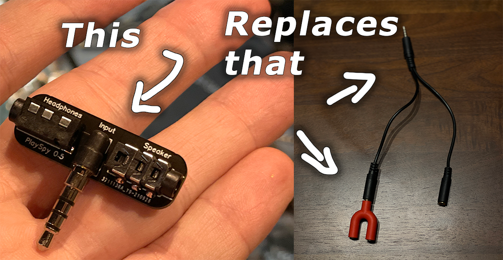
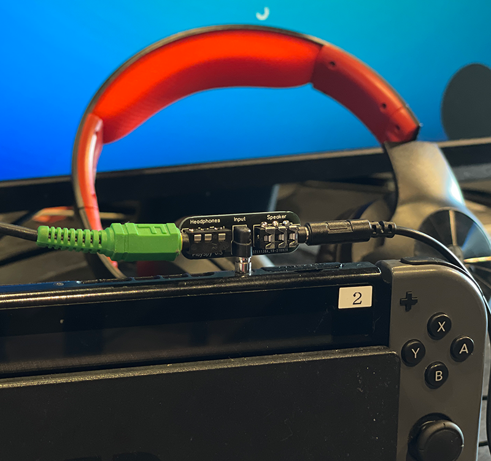
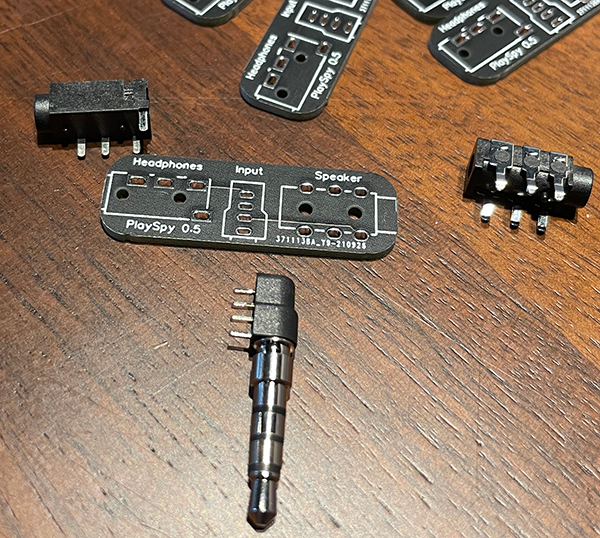

# PlaySpy
A hardware adaptor that lets you monitor your kids gaming audio on the Switch, even while they are chatting with the mic.

Sometimes you just need to be able to tune in to what's going on in a multiplayer game to protect your younger kids.  However, when using a headset+mic with the Switch, there is no way to also enable external sound at the same time.

Previously, I [explained how you could do it](https://www.codedojo.com/?p=2470) using a 3.5mm TRRS splitter, then splitting off just the stereo part (sans mic) to listen to.  However, it's REALLY HARD to find the correct version of that cable (the only one I could find is $10) and it's kind of messy to use anyway as it needs an additional adapter and can be confusing to use.

This simple adapter PCB does the same work as that cable+adapter and can be had for much cheaper.  I mean, if you made a few at once, anyway.

## How to make your own

Well, if you need help let me know, but basically you have to know how to get PCBs printed from Gerber files (I used jlcpcb) and how to order the correct parts and solder them on.  It's all DIP and pretty easy to solder.

BOM: (parts list, need 1 of each)

* PJ-3200B-4A  LCSC#:  [C136687](https://lcsc.com/product-detail/Audio-Connectors_Korean-Hroparts-Elec-PJ-3200B-4A_C136687.html)
* PJ-3136-B    LCSC#:  [C381131](https://lcsc.com/product-detail/Audio-Connectors_XKB-Connectivity-PJ-3136-B_C381131.html)
* 54-00035     Digi-Key#: [839-1239-ND](https://www.digikey.com/en/products/detail/tensility-international-corp/54-00035/5609420?s=N4IgTCBcDaIBwGYCcBaAjGZKByAREAugL5A)

Note: There has got to be a better source for the 54-00035 or a replacement, it's $3.25 each as listed.

The [Gerber zip](https://github.com/SethRobinson/PlaySpy/raw/main/pcb/Gerber_PCB_PlaySpy_2021-10-05.zip) is in the PCB subdirectory.

[EasyEda project is here](https://easyeda.com/Ransom/playspy)

Consider using lead free options for both the PCB and soldering in case a baby licks it.  Or make a case?

